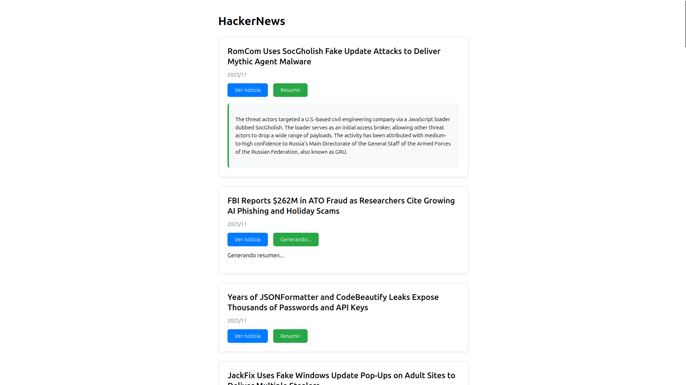

# Web-scrapping
Web scrapping de "The Hacker News"

# Instalación previa

(Desde el terminal)


### Dependencias de Python

```bash
pip install requests
pip install beautifulsoup4
```

### Dependencias de Node.js

```bash
npm install
```

# Ejecución

(Desde el terminal)

**1. Scraping con Python**
   
Ejecuta el script para obtener los artículos:
```bash
python web_scrapping.py
```
**2. Servidor con Node.js**
   
Dentro de la carpeta del proyecto:
```bash
node server.js
```

**2. Servidor con Node.js**
   
Abre en tu navegador: http://localhost:3000

## Ejemplo de la aplicación




# Extras
VS Code + extensión SQLite Viewer (para visualizar la base de datos)
